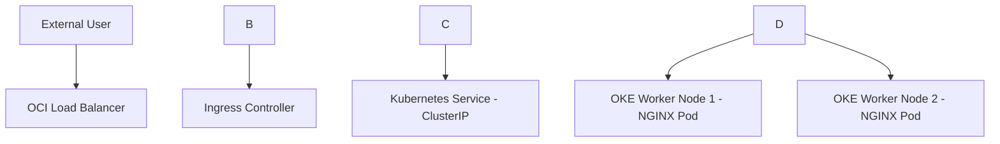

# OCI Kubernetes Deployment Architecture

## Overview

The repository explains a simple deployment flow using Oracle Kubernetes Engine, Kubernetes Deployment, Service, Ingress, and OCI Load Balancer.

My main takeaway from this exercise is that an application running in Kubernetes is not exposed directly. The traffic flow needs to be understood clearly, starting from the external user, then the OCI Load Balancer, then the Ingress Controller, then the Kubernetes Service, and finally the application pods running on worker nodes.

This repository is based on my own learning and documentation. No client-confidential, proprietary, or project-specific information is included.

\---

## Why I Created This

Kubernetes can look complex when the deployment, service, ingress, and load balancer are reviewed separately.

I created this repository to break the flow into simple sections. The goal is to understand how a basic web application can be deployed on OKE and how traffic reaches the application through Kubernetes and OCI networking components.

\---

## Product Used

Oracle Kubernetes Engine on Oracle Cloud Infrastructure

\---

## Simple Architecture Flow



This is a simple learning example. In a real implementation, the design may change based on security, network design, DNS, certificates, scaling, and application requirements.

\---

## Components Covered

This repository covers the following components:

* Oracle Kubernetes Engine
* OCI Load Balancer
* Kubernetes Deployment
* Kubernetes Service
* Kubernetes Ingress
* NGINX container image
* Basic external traffic flow to application pods

\---

## Kubernetes Resources Included

### Deployment

The deployment file creates two replicas of a simple NGINX web application pod.

File:

```text
kubernetes-manifests/deployment.yaml
```

### Service

The service file exposes the application inside the Kubernetes cluster using ClusterIP.

File:

```text
kubernetes-manifests/service.yaml
```

### Ingress

The ingress file defines how external HTTP traffic should be routed to the Kubernetes service.

File:

```text
kubernetes-manifests/ingress.yaml
```

The host value used in this repository is only a sample value for learning.

\---

## Deployment Commands

Apply the deployment:

```bash
kubectl apply -f kubernetes-manifests/deployment.yaml
```

Apply the service:

```bash
kubectl apply -f kubernetes-manifests/service.yaml
```

Apply the ingress:

```bash
kubectl apply -f kubernetes-manifests/ingress.yaml
```

\---

## Verification Commands

Check the pods:

```bash
kubectl get pods
```

Check the service:

```bash
kubectl get svc
```

Check the ingress:

```bash
kubectl get ingress
```

\---

## What I Learned

The key learning from this exercise is that OKE application deployment should not be viewed only as creating pods.

A working deployment needs multiple layers to work together. The Deployment keeps the application pods running. The Service provides internal access to the pods. The Ingress defines the external routing rule. The OCI Load Balancer helps route traffic from outside the cluster.

This helped me understand the basic relationship between OKE, Kubernetes resources, and OCI load balancing.

\---

## Confidentiality Note

All examples in this repository are based on my own learning and documentation. No client-confidential, proprietary, or project-specific information is included.

